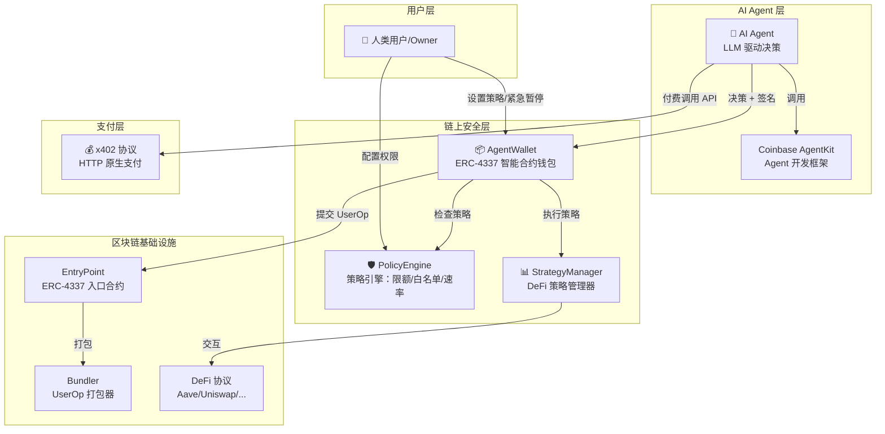
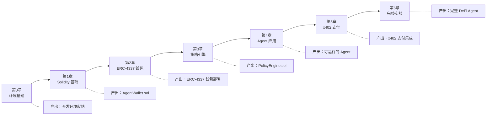

# 🤖 AI Agent 钱包开发全流程教程

> 从零开始，学会开发 AI Agent 钱包 + 链上自主交易应用
> 适用人群：懂区块链和智能合约基础，但对 AI + 区块链完全没经验的开发者
> 前置知识：了解 JavaScript/TypeScript 基础语法、了解以太坊基本概念（交易、Gas、合约）

---

## 🏗️ 系统架构总览

在开始学习之前，先看看我们最终要构建的系统全貌：



**核心理念**：AI Agent 拥有链上钱包的操作权限，但受到策略引擎的严格约束。人类用户保留最高权限（紧急暂停、修改策略），Agent 在授权范围内自主决策和执行交易。

---

## 📍 学习路线图



每章约 30-60 分钟，建议按顺序学习。每章末尾有"检查点"帮你确认进度。

---

## ⚡ 5 分钟快速体验

> 还没准备好深入学习？先用一条命令体验最终效果！

```bash
# 1. 克隆项目并安装依赖
git clone <本教程仓库>
cd ai-agent-wallet
npm install

# 2. 编译合约
npx hardhat compile

# 3. 运行快速体验 Demo（本地网络，无需 API Key）
npx hardhat run scripts/demo.ts --network hardhat
```

这个 Demo 会在本地 Hardhat 网络上：
1. 🏗️ 部署 AgentWallet + PolicyEngine 合约
2. 🤖 注册一个模拟 AI Agent 并配置策略
3. 💸 Agent 自主执行一笔 ETH 转账
4. 🛡️ 演示策略引擎如何拦截超限交易
5. 📊 展示交易历史和余额变化

**不需要测试网 ETH、不需要 API Key**，纯本地运行，帮你快速理解整个系统的工作流程。

---

## 📚 教程目录

| 章节 | 内容 | 难度 | 预计时间 |
|------|------|------|----------|
| **[第0章](docs/00-environment.md)** | 环境搭建与基础知识 | ⭐ | 20 分钟 |
| **[第1章](docs/01-solidity-basics.md)** | Solidity 智能合约基础 | ⭐⭐ | 45 分钟 |
| **[第2章](docs/02-erc4337-wallet.md)** | ERC-4337 智能合约钱包开发 | ⭐⭐⭐ | 60 分钟 |
| **[第3章](docs/03-policy-engine.md)** | 策略引擎合约开发 | ⭐⭐⭐ | 45 分钟 |
| **[第4章](docs/04-agent-app.md)** | Agent 应用开发（Node.js） | ⭐⭐⭐ | 60 分钟 |
| **[第5章](docs/05-x402-payment.md)** | x402 支付协议集成 | ⭐⭐⭐⭐ | 45 分钟 |
| **[第6章](docs/06-full-project.md)** | 完整实战：DeFi 自动理财 Agent | ⭐⭐⭐⭐⭐ | 90 分钟 |

---

## 📦 项目结构

```
ai-agent-wallet/
├── README.md                     # 本文件
├── package.json                  # 项目依赖
├── hardhat.config.ts             # Hardhat 配置（多网络）
├── .env.example                  # 环境变量模板
├── contracts/                    # 智能合约
│   ├── AgentWallet.sol           # AI Agent 钱包合约
│   ├── PolicyEngine.sol          # 策略引擎合约
│   ├── PolicyTemplates.sol       # 策略模板库
│   └── StrategyManager.sol       # DeFi 策略管理器
├── scripts/                      # 部署与交互脚本
│   ├── demo.ts                   # ⚡ 快速体验 Demo
│   ├── deploy.ts                 # 部署所有合约
│   ├── configure-agent.ts        # 配置 Agent
│   ├── test-agent.ts             # 测试 Agent 功能
│   ├── send-user-op.ts           # 发送 UserOperation
│   └── deploy-all.ts             # 一键部署全部
├── agent/                        # Agent 应用代码（第4-6章）
│   ├── simple-agent.ts           # 基础 Agent 示例
│   ├── defi-agent.ts             # DeFi Agent 示例
│   ├── agent-kit.ts              # Coinbase AgentKit 集成
│   └── agent-with-x402.ts        # 集成 x402 的 Agent
├── server/                       # 服务端代码（第5章）
│   └── x402-provider.ts          # x402 提供者服务
├── test/                         # 测试
│   ├── AgentWallet.test.ts       # 钱包合约测试
│   └── PolicyEngine.test.ts      # 策略引擎测试
└── docs/                         # 教程文档
    ├── 00-environment.md         # 环境搭建
    ├── 01-solidity-basics.md     # Solidity 基础
    ├── 02-erc4337-wallet.md      # ERC-4337 钱包
    ├── 03-policy-engine.md       # 策略引擎
    ├── 04-agent-app.md           # Agent 应用
    ├── 05-x402-payment.md        # x402 支付
    ├── 06-full-project.md        # 完整实战
    └── troubleshooting.md        # 常见问题排查
```

---

## 🎯 学完本教程你将能

1. ✅ 理解 AI Agent + 区块链的完整技术栈和设计理念
2. ✅ 编写和部署 ERC-4337 智能合约钱包
3. ✅ 设计 AI Agent 的安全策略引擎（限额、白名单、速率限制）
4. ✅ 开发能用钱包自主交易的 AI Agent（基于 LLM）
5. ✅ 集成 x402 协议实现 Agent 自主支付
6. ✅ 构建一个完整的 DeFi 自动理财 Agent

---

## 🛠️ 常用命令速查

| 命令 | 说明 |
|------|------|
| `npm run compile` | 编译合约 |
| `npm run test` | 运行测试 |
| `npm run node` | 启动本地 Hardhat 节点 |
| `npm run deploy:local` | 部署到本地网络 |
| `npm run deploy` | 部署到测试网 |
| `npm run deploy:all` | 一键部署所有合约 |
| `npm run configure` | 配置 Agent |
| `npm run agent:simple` | 启动基础 Agent |
| `npm run agent:defi` | 启动 DeFi Agent |
| `npm run server:x402` | 启动 x402 服务端 |

---

## ❓ 遇到问题？

- 📖 查看 [常见问题排查](docs/troubleshooting.md)
- 🐛 提交 Issue 描述你的问题
- 💬 每章末尾都有"常见问题"小节
