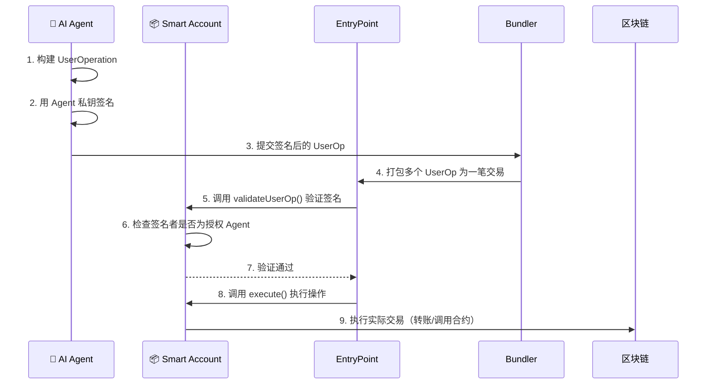
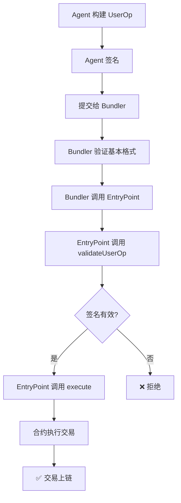

# 第2章：ERC-4337 智能合约钱包开发

> **本章在整体架构中的位置**：这是核心章节。你将开发 AI Agent 的"链上银行账户"——一个支持 Agent 自主操作的智能合约钱包。

---

## 📍 前情回顾

在第1章中，你已经：
- ✅ 掌握了 Solidity 基础语法（状态变量、函数、修饰器、事件）
- ✅ 理解了智能合约的部署和交互流程
- ✅ 成功编译并测试了第一个合约

现在，我们要用这些知识构建一个**真正有用的合约**——AI Agent 钱包。

---

## 2.1 为什么需要"智能合约钱包"？

### 传统钱包（EOA）的局限

你平时用的 MetaMask 就是一个 EOA（Externally Owned Account）钱包：

```
EOA 钱包工作方式：
  私钥 → 签名交易 → 发送到链上

问题：
  ❌ 每笔交易都需要人工签名
  ❌ 无法设置限额、白名单等规则
  ❌ 私钥丢了 = 钱没了，没有恢复机制
  ❌ 不能让 AI Agent 自主操作（除非把私钥给 Agent，太危险！）
```

### 智能合约钱包的优势

```
智能合约钱包工作方式：
  合约代码 → 验证逻辑 → 执行交易

优势：
  ✅ 可编程的验证逻辑（不只是签名验证）
  ✅ 可以设置规则：限额、白名单、时间窗口
  ✅ 支持多签、社交恢复
  ✅ 可以授权 Agent 在规则范围内自主操作！
```

### 现实类比

| | EOA 钱包 | 智能合约钱包 |
|---|---|---|
| 类比 | 你自己去银行柜台办业务 | 你给助理一张有限额的副卡 |
| 操作方式 | 每次都要本人签字 | 助理在授权范围内自由操作 |
| 安全性 | 签字笔丢了就完了 | 副卡有限额，挂失即冻结 |
| AI Agent 场景 | 把私钥给 AI（极度危险⚠️） | 给 AI 一个有限权限的操作入口 |

---

## 2.2 ERC-4337 账户抽象简介

ERC-4337 是以太坊的"账户抽象"标准，让智能合约钱包获得了和 EOA 一样的"发起交易"能力。

### 核心组件



### 关键概念速查

| 组件 | 作用 | 现实类比 |
|------|------|----------|
| **UserOperation** | Agent 发起的"交易请求" | 填好的转账申请单 |
| **EntryPoint** | 验证+执行的核心合约 | 银行的审批系统 |
| **Smart Account** | Agent 的智能合约钱包 | 你的银行账户 |
| **Bundler** | 打包多个 UserOp 为一笔链上交易 | 快递员（攒一批一起送） |
| **Paymaster** | 代付 Gas 费（可选） | 公司报销制度 |

> 💡 **关键理解**：Agent 不直接发送链上交易，而是构建一个 UserOperation，由 Bundler 代为提交。Smart Account 合约负责验证"这个 UserOp 是否来自授权的 Agent"。

---

## 2.3 开发 AgentWallet 合约（渐进式）

我们分三步构建钱包合约：

### 第一步：基础框架 — 所有权和接收 ETH

```solidity
// SPDX-License-Identifier: MIT
pragma solidity ^0.8.24;

/// @title AgentWallet - 第一步：基础框架
contract AgentWallet {
    address public owner;

    modifier onlyOwner() {
        require(msg.sender == owner, "AgentWallet: only owner");
        _;
    }

    constructor() {
        owner = msg.sender;
    }

    /// @notice 接收 ETH
    receive() external payable {}

    /// @notice 查看余额
    function getBalance() external view returns (uint256) {
        return address(this).balance;
    }
}
```

> 💡 这就是最简单的合约钱包：能接收 ETH，只有 owner 能操作。

### 第二步：Agent 注册与策略约束

```solidity
/// @title AgentWallet - 第二步：加入 Agent 管理和策略
contract AgentWallet {
    // ... 第一步的代码 ...

    struct AgentInfo {
        address agentAddress;
        string name;
        string description;
        uint256 registeredAt;
        bool active;
    }

    struct PolicyConfig {
        uint256 dailyLimit;     // 日限额（wei）
        uint256 perTxLimit;     // 单笔限额（wei）
        uint256 dailyUsed;      // 今日已用
        uint256 lastResetDay;   // 上次重置日期
    }

    AgentInfo[] public agents;
    mapping(address => uint256) public agentIndex;
    mapping(address => PolicyConfig) public agentPolicies;

    modifier onlyActiveAgent() {
        uint256 idx = agentIndex[msg.sender];
        require(idx > 0, "AgentWallet: agent not found");
        require(agents[idx - 1].active, "AgentWallet: agent not active");
        _;
    }

    /// @notice 注册 Agent（只有 Owner 能操作）
    function registerAgent(
        address _agentAddress,
        string calldata _name,
        string calldata _description,
        uint256 _dailyLimit,
        uint256 _perTxLimit
    ) external onlyOwner {
        // ... 注册逻辑
    }
}
```

> 💡 现在 Owner 可以注册 Agent 并设置限额。Agent 的权限被严格约束。

### 第三步：Agent 执行交易

```solidity
/// @title AgentWallet - 第三步：Agent 自主执行交易
contract AgentWallet {
    // ... 前两步的代码 ...

    modifier checkPolicy(address _agent, uint256 _value) {
        PolicyConfig storage policy = agentPolicies[_agent];
        require(_value <= policy.perTxLimit, "AgentWallet: exceeds per-tx limit");

        uint256 today = block.timestamp / 1 days;
        if (policy.lastResetDay < today) {
            policy.dailyUsed = 0;
            policy.lastResetDay = today;
        }
        require(policy.dailyUsed + _value <= policy.dailyLimit, "AgentWallet: exceeds daily limit");
        _;
    }

    /// @notice Agent 执行 ETH 转账
    function executeTransfer(
        address payable _to,
        uint256 _value
    ) external onlyActiveAgent checkPolicy(msg.sender, _value) {
        require(address(this).balance >= _value, "AgentWallet: insufficient balance");

        PolicyConfig storage policy = agentPolicies[msg.sender];
        policy.dailyUsed += _value;

        (bool success, ) = _to.call{value: _value}("");
        require(success, "AgentWallet: transfer failed");
    }
}
```

> 💡 Agent 现在可以自主转账了！但每笔交易都要通过 `checkPolicy` 修饰器的检查。

---

## 2.4 完整合约代码

以上三步合并后的完整代码就是项目中的 `contracts/AgentWallet.sol`。

运行以下命令验证合约可以编译：

```bash
npx hardhat compile
```

预期输出：
```
Compiled X Solidity files successfully (evm target: cancun).
```

---

## 2.5 测试钱包合约

项目中已经有完整的测试文件 `test/AgentWallet.test.ts`，让我们运行它：

```bash
npx hardhat test test/AgentWallet.test.ts
```

预期输出：
```
  AgentWallet
    Deployment
      ✔ should set the owner correctly
      ✔ should start with zero balance
      ✔ should not be paused initially
    Agent Management
      ✔ should register an agent
      ✔ should not allow duplicate agent registration
      ✔ should deactivate and reactivate an agent
    Transaction Execution
      ✔ should execute ETH transfer as agent
      ✔ should reject transfer exceeding per-tx limit
      ✔ should reject transfer when paused
      ✔ should track transaction history
    Policy Management
      ✔ should update agent policy
      ✔ should manage whitelist
    Ownership
      ✔ should transfer ownership
      ✔ should only allow owner to transfer ownership

  14 passing
```

### 测试代码解读

打开 `test/AgentWallet.test.ts`，关注几个关键测试：

```typescript
// 测试 Agent 执行转账
it("should execute ETH transfer as agent", async function () {
  // Agent 调用 executeTransfer，转 0.1 ETH 给 user
  await wallet.connect(agent).executeTransfer(user.address, ethers.parseEther("0.1"));
  // 验证 user 余额增加了 0.1 ETH
});

// 测试策略拦截
it("should reject transfer exceeding per-tx limit", async function () {
  // Agent 尝试转 0.5 ETH（超过 0.1 ETH 的单笔限额）
  await expect(
    wallet.connect(agent).executeTransfer(user.address, ethers.parseEther("0.5"))
  ).to.be.revertedWith("AgentWallet: exceeds per-tx limit");
  // 交易被拒绝 ✅
});
```

---

## 2.6 ERC-4337 UserOperation（进阶概念）

> ⚠️ 本节为进阶内容。如果你是第一次学习，可以先跳过，完成第3-4章后再回来。

在实际生产环境中，Agent 不会直接调用合约函数，而是通过 ERC-4337 的 UserOperation 机制：

### UserOperation 的生命周期



### 为什么用 UserOperation 而不是直接调用？

| 直接调用 | UserOperation |
|----------|---------------|
| Agent 需要 ETH 付 Gas | 可以用 Paymaster 代付 Gas |
| Agent 的 EOA 暴露在链上 | Agent 身份可以更灵活 |
| 一次只能执行一个操作 | 可以批量执行多个操作 |
| 无法实现复杂验证逻辑 | 验证逻辑完全可编程 |

> 💡 在本教程中，我们的 `AgentWallet.sol` 使用直接调用方式（更简单易懂）。生产环境建议升级为完整的 ERC-4337 实现。

---

## 2.7 部署到本地网络验证

让我们在本地 Hardhat 网络上部署并交互：

```bash
# 启动本地节点（新终端窗口）
npx hardhat node

# 部署合约（另一个终端）
npx hardhat run scripts/deploy.ts --network localhost
```

预期输出：
```
Deploying AgentWallet...
AgentWallet deployed to: 0x5FbDB2315678afecb367f032d93F642f64180aa3
PolicyEngine deployed to: 0xe7f1725E7734CE288F8367e1Bb143E90bb3F0512
StrategyManager deployed to: 0x9fE46736679d2D9a65F0992F2272dE9f3c7fa6e0

=== Deployment Summary ===
Network: unknown
Chain ID: 31337
...
Deployment info saved to deployment.json
```

---

## ✅ 本章检查点

完成本章后，确认以下事项：

### 文件清单
- [x] `contracts/AgentWallet.sol` — 完整的 Agent 钱包合约
- [x] `test/AgentWallet.test.ts` — 钱包合约测试
- [x] `scripts/deploy.ts` — 部署脚本

### 验证命令
```bash
# 编译通过
npx hardhat compile

# 所有测试通过
npx hardhat test test/AgentWallet.test.ts

# 本地部署成功
npx hardhat run scripts/deploy.ts --network hardhat
```

### 你应该理解的概念
- [x] EOA 钱包 vs 智能合约钱包的区别
- [x] 为什么 AI Agent 需要智能合约钱包（而不是直接给私钥）
- [x] Agent 注册、策略约束、交易执行的完整流程
- [x] ERC-4337 UserOperation 的基本概念（进阶）

---

## 🔗 下一章预告

钱包合约已经有了基本的限额控制，但这还不够：
- 如果 Agent 需要只和特定合约交互怎么办？（白名单）
- 如果 Agent 交易太频繁怎么办？（速率限制）
- 如果需要只在工作时间允许交易怎么办？（时间窗口）

→ 进入 [第3章：策略引擎合约开发](03-policy-engine.md)，实现更丰富的安全策略。
