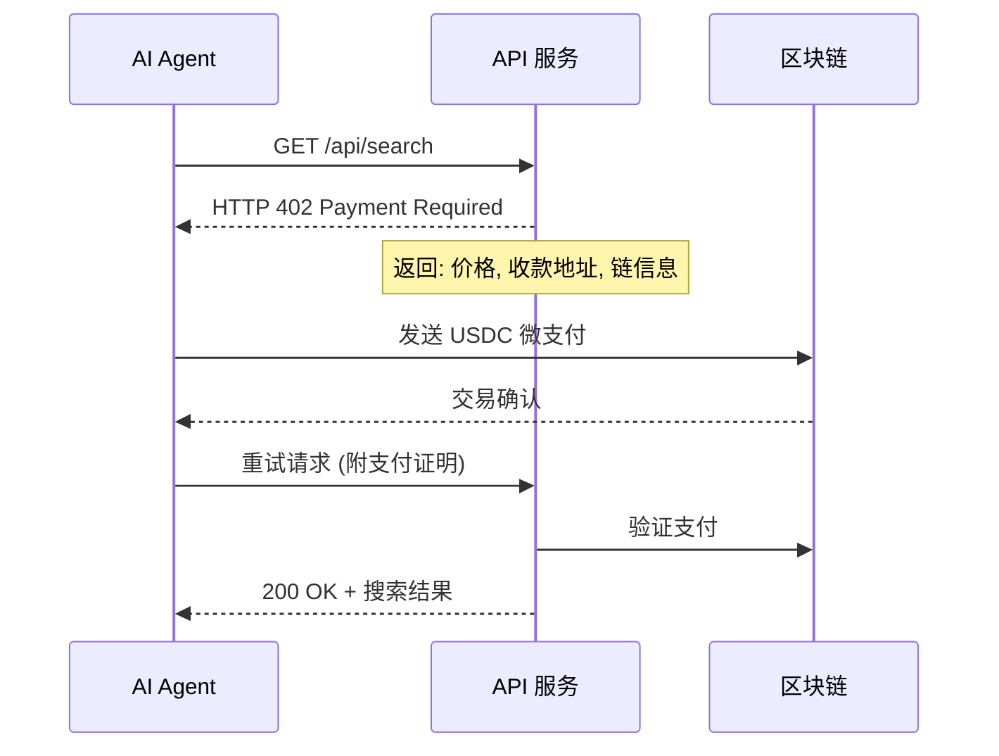

# 第5章：x402 支付协议集成

> **本章在整体架构中的位置**：x402 是 Agent 的“支付能力”——让 Agent 能像人一样付费调用外部服务，不需要 API Key。

---

## 📍 前情回顾

在第4章中，你已经：
- ✅ 开发了基于 LLM 的 AI Agent（理解自然语言 → 执行链上操作）
- ✅ 集成了 Coinbase AgentKit
- ✅ 理解了 Agent 的完整思考和执行流程

但 Agent 目前只能操作自己的钱包。如果它需要调用外部付费 API（如搜索、数据服务），传统方式是给它一个 API Key——但这有泄露风险。x402 协议提供了更优雅的解决方案。

---

## 5.1 x402 是什么？

```
传统 API:  注册账号 → 拿到 API Key → 每月账单
x402 API:  直接请求 → 收到 HTTP 402 → 付 USDC → 拿到结果
```

**x402 的核心思想**：HTTP 协议本来就有 402 Payment Required 状态码，但 30 年来没人用。Coinbase 在 2025 年复活了它，让 AI Agent 能原生支付。

### 工作流程



---

## 5.2 作为"消费者"：Agent 调用 x402 API

创建 `agent/x402-consumer.ts`：

```typescript
import { ethers } from "ethers";
import * as dotenv from "dotenv";

dotenv.config();

/**
 * x402 消费者
 * Agent 通过 x402 协议支付并调用 API
 */
class X402Consumer {
  private provider: ethers.Provider;
  private wallet: ethers.Wallet;
  private baseUrl: string;

  constructor() {
    this.provider = new ethers.JsonRpcProvider(process.env.BASE_RPC_URL);
    this.wallet = new ethers.Wallet(process.env.AGENT_PRIVATE_KEY!, this.provider);
    this.baseUrl = "https://api.x402.org"; // x402 兼容 API
  }

  /**
   * 通过 x402 协议调用 API
   * 
   * 流程：
   * 1. 先直接请求（可能被拒绝）
   * 2. 如果收到 402，查看价格并支付
   * 3. 支付后重试请求
   */
  async callAPI(endpoint: string): Promise<any> {
    const url = `${this.baseUrl}${endpoint}`;

    // 第一步：尝试请求（不带支付）
    console.log("📤 发送请求...");
    let response = await fetch(url);

    // 如果返回 402，需要支付
    if (response.status === 402) {
      const paymentInfo = await response.json();
      console.log("💳 需要支付:", paymentInfo);

      // 支付
      const txHash = await this.pay(paymentInfo);
      console.log("✅ 支付成功:", txHash);

      // 第二步：带支付证明重试
      response = await fetch(url, {
        headers: {
          "X-Payment-Tx": txHash,
          "X-Payment-Chain": "base",
        },
      });
    }

    if (!response.ok) {
      throw new Error(`API 请求失败: ${response.status}`);
    }

    return response.json();
  }

  /**
   * 支付 x402 费用
   */
  private async pay(paymentInfo: any): Promise<string> {
    const { amount, currency, recipient, chainId } = paymentInfo;

    // USDC 合约地址（Base 链）
    const USDC_ADDRESS = "0x833589fCD6eDb6E08f4c7C32D4f71b54bdA02913";

    if (currency === "USDC") {
      // 转账 USDC
      const usdc = new ethers.Contract(
        USDC_ADDRESS,
        [
          "function transfer(address to, uint256 amount) returns (bool)",
          "function decimals() view returns (uint8)",
        ],
        this.wallet
      );

      const decimals = await usdc.decimals();
      const amountWei = ethers.parseUnits(amount.toString(), decimals);

      const tx = await usdc.transfer(recipient, amountWei);
      const receipt = await tx.wait();
      return receipt.hash;
    } else {
      // 直接转账 ETH/Base ETH
      const tx = await this.wallet.sendTransaction({
        to: recipient,
        value: ethers.parseEther(amount.toString()),
      });
      const receipt = await tx.wait();
      return receipt!.hash;
    }
  }

  /**
   * 搜索（x402 微支付示例）
   * 每次搜索 $0.001
   */
  async search(query: string): Promise<any> {
    return this.callAPI(`/search?q=${encodeURIComponent(query)}`);
  }

  /**
   * 调用 AI 模型（x402 微支付示例）
   * 每次调用 $0.01
   */
  async callAI(prompt: string): Promise<any> {
    return this.callAPI(`/ai/completion?prompt=${encodeURIComponent(prompt)}`);
  }
}

// ============ 使用示例 ============

async function main() {
  const consumer = new X402Consumer();

  console.log("🤖 x402 消费者启动\n");

  // 示例：通过 x402 搜索
  try {
    const result = await consumer.search("以太坊价格");
    console.log("搜索结果:", result);
  } catch (error) {
    console.error("搜索失败:", error);
  }

  // 示例：通过 x402 调用 AI
  try {
    const result = await consumer.callAI("用一句话解释什么是 DeFi");
    console.log("AI 回复:", result);
  } catch (error) {
    console.error("AI 调用失败:", error);
  }
}

main().catch(console.error);
```

---

## 5.3 作为"提供者"：让你的 API 支持 x402

创建 `server/x402-provider.ts`：

```typescript
import express from "express";
import { ethers } from "ethers";

/**
 * x402 提供者
 * 让你的 API 支持 x402 支付
 */
class X402Provider {
  private app: express.Application;
  private provider: ethers.Provider;
  private wallet: ethers.Wallet;
  private prices: Map<string, { amount: number; currency: string }>;

  constructor() {
    this.app = express();
    this.provider = new ethers.JsonRpcProvider(process.env.BASE_RPC_URL!);
    this.wallet = new ethers.Wallet(process.env.PROVIDER_PRIVATE_KEY!, this.provider);

    // 定义各 API 的价格
    this.prices = new Map([
      ["/api/search", { amount: 0.001, currency: "USDC" }],  // 搜索 $0.001
      ["/api/ai", { amount: 0.01, currency: "USDC" }],       // AI $0.01
      ["/api/data", { amount: 0.05, currency: "USDC" }],     // 数据 $0.05
    ]);

    this.setupRoutes();
  }

  /**
   * 设置路由
   */
  private setupRoutes() {
    // 中间件：检查支付
    this.app.use("/api", this.paymentMiddleware.bind(this));

    // API 路由
    this.app.get("/api/search", (req, res) => {
      res.json({ results: ["结果1", "结果2"], query: req.query.q });
    });

    this.app.post("/api/ai", (req, res) => {
      res.json({ response: "这是 AI 的回复", prompt: req.body.prompt });
    });
  }

  /**
   * 支付中间件
   * 检查请求是否已支付，未支付则返回 402
   */
  private async paymentMiddleware(
    req: express.Request,
    res: express.Response,
    next: express.NextFunction
  ) {
    const price = this.getPrice(req.path);

    // 如果该路径不需要付费
    if (!price) {
      next();
      return;
    }

    // 检查是否已支付
    const paymentTx = req.headers["x-payment-tx"] as string;
    if (paymentTx) {
      const isValid = await this.verifyPayment(paymentTx, price);
      if (isValid) {
        next();
        return;
      }
    }

    // 未支付，返回 402
    res.status(402).json({
      error: "Payment Required",
      message: `This API costs ${price.amount} ${price.currency}`,
      amount: price.amount,
      currency: price.currency,
      recipient: await this.wallet.getAddress(),
      chainId: 8453, // Base 主网
    });
  }

  /**
   * 获取 API 价格
   */
  private getPrice(path: string): { amount: number; currency: string } | null {
    for (const [route, price] of this.prices) {
      if (path.startsWith(route)) {
        return price;
      }
    }
    return null;
  }

  /**
   * 验证支付是否有效
   */
  private async verifyPayment(
    txHash: string,
    expectedPrice: { amount: number; currency: string }
  ): Promise<boolean> {
    try {
      const receipt = await this.provider.getTransactionReceipt(txHash);
      if (!receipt) return false;

      const tx = await this.provider.getTransaction(txHash);
      if (!tx) return false;

      // 验证接收地址是否正确
      if (tx.to?.toLowerCase() !== (await this.wallet.getAddress()).toLowerCase()) {
        return false;
      }

      // 验证金额是否正确
      const expectedWei = ethers.parseUnits(
        expectedPrice.amount.toString(),
        expectedPrice.currency === "USDC" ? 6 : 18
      );

      // 对于 USDC，需要检查 Transfer 事件
      if (expectedPrice.currency === "USDC") {
        const usdcInterface = new ethers.Interface([
          "event Transfer(address indexed from, address indexed to, uint256 value)",
        ]);

        for (const log of receipt.logs) {
          try {
            const parsed = usdcInterface.parseLog(log);
            if (
              parsed &&
              parsed.args.to.toLowerCase() === (await this.wallet.getAddress()).toLowerCase() &&
              parsed.args.value >= expectedWei
            ) {
              return true;
            }
          } catch {}
        }
        return false;
      }

      // 对于 ETH，直接检查 value
      return tx.value >= expectedWei;
    } catch {
      return false;
    }
  }

  /**
   * 启动服务器
   */
  start(port: number = 3000) {
    this.app.listen(port, () => {
      console.log(`🟢 x402 Provider 运行在 http://localhost:${port}`);
      console.log("支持的 API:");
      for (const [route, price] of this.prices) {
        console.log(`  ${route}: ${price.amount} ${price.currency}`);
      }
    });
  }
}

// 启动
const provider = new X402Provider();
provider.start(3000);
```

---

## 5.4 在 Agent 中集成 x402

将 x402 支付能力集成到我们之前开发的 Agent 中：

创建 `agent/agent-with-x402.ts`：

```typescript
import { X402Consumer } from "./x402-consumer";
import { AIAgent } from "./simple-agent";

/**
 * 带 x402 支付能力的 AI Agent
 * 
 * Agent 现在可以：
 * 1. 通过钱包执行链上交易
 * 2. 通过 x402 支付调用外部 API
 * 3. 自主决定何时需要付费
 */
class AgentWithX402 extends AIAgent {
  private x402: X402Consumer;

  constructor() {
    super();
    this.x402 = new X402Consumer();
  }

  /**
   * 扩展工具集，加入 x402 能力
   */
  protected getTools(): any[] {
    const baseTools = super.getTools();

    return [
      ...baseTools,
      {
        name: "x402Search",
        description: "通过 x402 微支付搜索互联网（每次 $0.001）",
        parameters: {
          type: "object",
          properties: {
            query: { type: "string", description: "搜索关键词" },
          },
          required: ["query"],
        },
      },
      {
        name: "x402CallAI",
        description: "通过 x402 微支付调用外部 AI 模型（每次 $0.01）",
        parameters: {
          type: "object",
          properties: {
            prompt: { type: "string", description: "提示词" },
          },
          required: ["prompt"],
        },
      },
      {
        name: "x402GetData",
        description: "通过 x402 微支付获取链上数据（每次 $0.05）",
        parameters: {
          type: "object",
          properties: {
            dataType: {
              type: "string",
              enum: ["price", "volume", "gas"],
              description: "数据类型",
            },
          },
          required: ["dataType"],
        },
      },
    ];
  }

  /**
   * 处理 x402 工具调用
   */
  protected async handleX402Call(
    functionName: string,
    args: any
  ): Promise<string> {
    switch (functionName) {
      case "x402Search": {
        const result = await this.x402.search(args.query);
        return `搜索完成（花费 $0.001 USDC）:\n${JSON.stringify(result, null, 2)}`;
      }

      case "x402CallAI": {
        const result = await this.x402.callAI(args.prompt);
        return `AI 调用完成（花费 $0.01 USDC）:\n${result}`;
      }

      case "x402GetData": {
        const result = await this.x402.callAPI(`/data/${args.dataType}`);
        return `数据获取完成（花费 $0.05 USDC）:\n${JSON.stringify(result, null, 2)}`;
      }

      default:
        return `未知的 x402 工具: ${functionName}`;
    }
  }
}
```

---

## 5.5 运行 x402 集成测试

```bash
# 启动 x402 提供者（另一个终端）
npx ts-node server/x402-provider.ts

# 运行 x402 消费者
npx ts-node agent/x402-consumer.ts

# 或运行带 x402 的 Agent
npx ts-node agent/agent-with-x402.ts
```

---

## 5.6 x402 生态现状（2026年6月）

| 项目 | 角色 | 说明 |
|------|------|------|
| **x402 基金会** | 标准制定 | Coinbase + Cloudflare + Google + Visa 联合成立 |
| **Superhighway** | 搜索 API | Agent 原生 Web 搜索，每次 $0.001 |
| **x402 Bazaar** | 市场 | Coinbase 推出的 Agent 服务市场 |
| **Stripe ACS** | 支付 | Stripe Agentic Commerce Suite 支持 x402 |
| **累计交易** | 数据 | 截至2026年4月已处理 **1.67亿笔** |

---

## ✅ 本章检查点

完成本章后，确认以下事项：

### 文件清单
- [x] `agent/x402-consumer.ts` — x402 消费者（Agent 付费调用 API）
- [x] `server/x402-provider.ts` — x402 提供者（你的 API 支持 x402）
- [x] `agent/agent-with-x402.ts` — 集成 x402 的完整 Agent

### 验证命令
```bash
# 启动 x402 提供者服务（新终端）
npx ts-node server/x402-provider.ts

# 运行 x402 消费者测试
npx ts-node agent/x402-consumer.ts
```

### 你应该理解的概念
- [x] x402 协议的工作流程：请求 → 402 → 支付 → 重试
- [x] 消费者端：Agent 如何自动处理支付流程
- [x] 提供者端：如何让你的 API 支持 x402
- [x] x402 vs 传统 API Key 的优势

### 常见问题

| 问题 | 解决方案 |
|------|----------|
| x402 支付失败 | 确认 Agent 钱包有足够 USDC（Base 链） |
| 服务端验证支付失败 | 检查链 ID 和收款地址是否匹配 |
| 本地测试无法支付 | x402 需要真实链上交易，本地测试可 mock 支付流程 |

---

## 🔗 下一章预告

所有组件都已就绪！现在让我们把它们组装成一个完整的 DeFi 自动理财 Agent：
- AgentWallet（链上钱包）+ PolicyEngine（安全策略）+ AI Agent（LLM 决策）+ x402（支付能力）
- 实现自动定投、收益监控、风险控制

→ 进入 [第6章：完整实战 — DeFi 自动理财 Agent](06-full-project.md)
