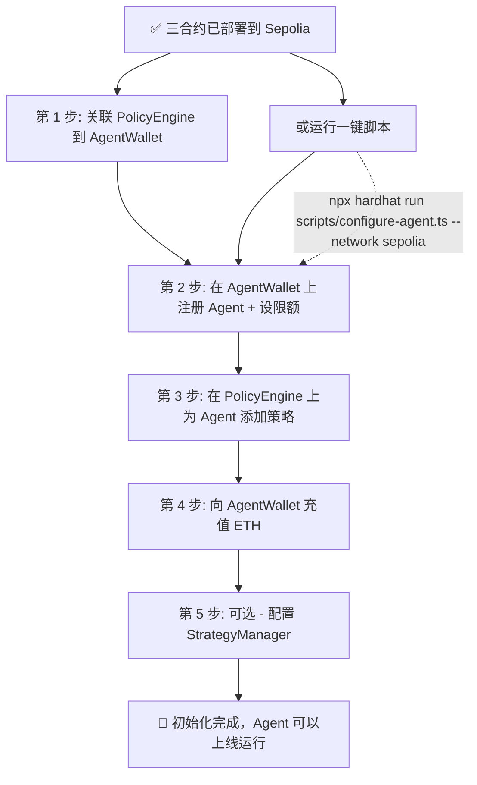

# 部署后初始化指南

当 AgentWallet、PolicyEngine、StrategyManager 三个合约成功部署到 Sepolia 测试网后，还需要执行一系列初始化操作才能让 Agent 正常运行。

## 初始化流程总览



---

## 第 1 步：关联 PolicyEngine 到 AgentWallet

`PolicyEngine` 的构造函数不需要参数，但它需要知道它服务哪个钱包合约。部署后需要调用 `AgentWallet.setPolicyEngine(engineAddress)` 将策略引擎关联到钱包合约。

> 如果使用 `deploy-all.ts` 一键部署，脚本会自动尝试这一步。

**手动操作：**

```javascript
// 获取合约实例
const wallet = await ethers.getContractAt("AgentWallet", walletAddress);
// 设置策略引擎
const tx = await wallet.setPolicyEngine(engineAddress);
await tx.wait();
```

---

## 第 2 步：在 AgentWallet 上注册 Agent

在 `AgentWallet` 合约上调用 `registerAgent()`，注册你的 AI Agent：

```solidity
function registerAgent(
    address _agentAddress,    // Agent 的 EOA 或合约地址
    string calldata _name,    // Agent 名称，如 "DeFi Agent v1"
    string calldata _description, // Agent 描述
    uint256 _dailyLimit,      // 日限额（wei），如 1 ETH → 1000000000000000000
    uint256 _perTxLimit       // 单笔限额（wei），如 0.1 ETH → 100000000000000000
) external onlyOwner
```

**示例：**

```javascript
const wallet = await ethers.getContractAt("AgentWallet", walletAddress);
const tx = await wallet.registerAgent(
    agentAddress,
    "DeFi Agent v1",
    "自动 DeFi 理财 Agent - 负责 Aave 存款和 Uniswap 流动性提供",
    ethers.parseEther("1"),    // 日限额 1 ETH
    ethers.parseEther("0.1")   // 单笔限额 0.1 ETH
);
await tx.wait();
```

注册完成后，`registerAgent()` 会自动为该 Agent 创建默认的策略配置（限额参数）。

---

## 第 3 步：在 PolicyEngine 上为 Agent 添加策略

调用 `PolicyEngine` 的策略管理函数，为注册好的 Agent 配置安全策略。项目支持 6 种策略类型：

| 策略 | 方法 | 说明 | 推荐配置 |
|------|------|------|----------|
| **白名单** | `addWhitelistPolicy()` | 只允许与白名单地址交互（如 Uniswap Router、Aave Pool） | ✅ 推荐 |
| **黑名单** | `addBlacklistPolicy()` | 禁止与黑名单地址交互 | 可选 |
| **限额** | `addSpendingLimitPolicy()` | 日限额 + 单笔限额 | ✅ 推荐 |
| **速率限制** | `addRateLimitPolicy()` | 时间窗口内最大交易数（如每小时 20 笔） | ✅ 推荐 |
| **时间窗口** | `addTimeWindowPolicy()` | 仅在指定时间段允许交易（如工作日 8:00-22:00） | 可选 |
| **滑点保护** | `addSlippagePolicy()` | DEX 交易最大滑点（基点，1% = 100 bps） | DeFi 交易推荐 |

**推荐最小策略组合：白名单 + 限额 + 速率限制**

### 白名单策略

```javascript
const policyEngine = await ethers.getContractAt("PolicyEngine", engineAddress);
const tx = await policyEngine.addWhitelistPolicy(
    agentAddress,
    [
        "0x...", // Uniswap V3 Router
        "0x...", // Aave V3 Pool
        "0x...", // 其他允许交互的协议地址
    ],
    "Only allow DeFi protocol interactions"
);
await tx.wait();
```

### 限额策略

```javascript
const tx = await policyEngine.addSpendingLimitPolicy(
    agentAddress,
    ethers.parseEther("1"),    // 日限额 1 ETH
    ethers.parseEther("0.1"),  // 单笔限额 0.1 ETH
    "Daily and per-transaction spending limits"
);
await tx.wait();
```

### 速率限制策略

```javascript
const tx = await policyEngine.addRateLimitPolicy(
    agentAddress,
    20,     // 每小时最多 20 笔交易
    3600,   // 时间窗口 1 小时
    "Rate limit: 20 tx per hour"
);
await tx.wait();
```

### 时间窗口策略

```javascript
const tx = await policyEngine.addTimeWindowPolicy(
    agentAddress,
    8,                   // 上午 8 点开始（从午夜算起的秒数）
    22,                  // 晚上 10 点结束
    [1, 2, 3, 4, 5],     // 周一至周五（0=周日, 1=周一, ..., 6=周六）
    "Only allow transactions during business hours (Mon-Fri, 8:00-22:00)"
);
await tx.wait();
```

### 滑点保护策略

```javascript
const tx = await policyEngine.addSlippagePolicy(
    agentAddress,
    100,    // 最大滑点 100 基点 = 1%
    "Slippage protection: max 1%"
);
await tx.wait();
```

---

## 第 4 步：给钱包充值

Agent 需要 ETH 来执行交易和支付 Gas。向 `AgentWallet` 合约地址发送 ETH 即可（合约有 `receive()` 函数接收 ETH）：

```bash
# 使用 cast 发送 ETH
cast send --rpc-url $SEPOLIA_RPC_URL --private-key $PRIVATE_KEY \
    $WALLET_CONTRACT_ADDRESS --value 0.5ether
```

或在脚本中：

```javascript
const [deployer] = await ethers.getSigners();
const tx = await deployer.sendTransaction({
    to: walletAddress,
    value: ethers.parseEther("0.5"), // 充入 0.5 ETH
});
await tx.wait();
```

充值后可以调用 `wallet.getBalance()` 查看余额。

---

## 第 5 步：配置 StrategyManager（可选）

如果你需要自动 DeFi 策略（如 Aave 存款、Uniswap LP），需要在 `StrategyManager` 上进行配置：

### 添加策略

```javascript
const strategyManager = await ethers.getContractAt("StrategyManager", strategyAddress);
const tx = await strategyManager.addStrategy(
    "Aave USDC Lending",               // 策略名称
    0,                                   // StrategyType.Lending
    "0x...",                             // Aave V3 Pool 地址
    "0x",                                // initParams
    ethers.parseEther("0.1"),            // 分配 0.1 ETH
    "Lend USDC on Aave V3 for yield"     // 描述
);
await tx.wait();
```

### 激活策略

```javascript
const tx = await strategyManager.activateStrategy(strategyId);
await tx.wait();
```

### 暂停策略

```javascript
const tx = await strategyManager.pauseStrategy(strategyId);
await tx.wait();
```

### 移除策略

```javascript
const tx = await strategyManager.removeStrategy(strategyId);
await tx.wait();
```

---

## 一键配置脚本

项目中提供了现成的配置脚本 `scripts/configure-agent.ts`，可以自动完成第 2-3 步：

```bash
npx hardhat run scripts/configure-agent.ts --network sepolia
```

脚本会依次执行：
1. 读取 `deployment.json` 中的合约地址
2. 在 `AgentWallet` 上注册 Agent（名称 "DeFi Agent v1"，日限额 1 ETH，单笔限额 0.1 ETH）
3. 在 `PolicyEngine` 上添加白名单策略（只允许与 DeFi 协议交互）
4. 添加限额策略
5. 添加速率限制（每小时 20 笔）
6. 添加时间窗口策略（工作日 8:00-22:00）
7. 保存配置到 `agent-config.json`

> ⚠️ **注意**：脚本中的白名单地址是示例占位符（`0x0000000000000000000000000000000000000001` 等），你需要将其替换为真实的 DeFi 协议地址（如 Sepolia 上的 Uniswap V3 Router、Aave V3 Pool 等）。

如果不想用一键脚本，也可以手动通过 `cast` 或自定义脚本逐步调用合约函数来配置。

---

## 验证初始化结果

初始化完成后，验证以下内容：

### 1. Agent 已注册且激活

```javascript
const agentInfo = await wallet.getAgentInfo(agentAddress);
console.log("Agent name:", agentInfo.name);
console.log("Agent active:", agentInfo.active);
```

### 2. 策略已配置

```javascript
const policyCount = await policyEngine.getPolicyCount(agentAddress);
console.log("Policy count:", policyCount.toString());

const policy = await wallet.getAgentPolicy(agentAddress);
console.log("Daily limit:", ethers.formatEther(policy.dailyLimit), "ETH");
console.log("Per-tx limit:", ethers.formatEther(policy.perTxLimit), "ETH");
```

### 3. 钱包有余额

```javascript
const balance = await wallet.getBalance();
console.log("Wallet balance:", ethers.formatEther(balance), "ETH");
```

### 4. 策略引擎已关联

```javascript
const engineAddr = await policyEngine.walletAddress();
console.log("PolicyEngine wallet:", engineAddr);
console.log("Matches wallet:", engineAddr === walletAddress);
```

### 5. 合约在 Etherscan 上可查

在 [Sepolia Etherscan](https://sepolia.etherscan.io/) 上输入合约地址，查看合约状态和交易记录。

---

## 更新 .env 文件

配置完成后，确保 `.env` 文件中包含所有合约地址：

```bash
WALLET_CONTRACT_ADDRESS=0x你的AgentWallet地址
POLICY_ENGINE_ADDRESS=0x你的PolicyEngine地址
STRATEGY_MANAGER_ADDRESS=0x你的StrategyManager地址
```

---

## 常见问题

### Q: 执行 `configure-agent.ts` 报错 "agent already registered"？
A: 说明该 Agent 地址已经注册过了。你可以选择跳过注册步骤，或者先调用 `deactivateAgent()` 停用旧 Agent，再重新注册。

### Q: 白名单地址应该填什么？
A: 需要填写 Agent 实际需要交互的 DeFi 协议地址，例如 Sepolia 上的：
- Uniswap V3 SwapRouter: `0x3bFA4769B0967e3ec1f994B5c53B6F41CEe4F2d1`
- Aave V3 Pool: `0x6Ae43d3f83E9562C5E4C7E9fA64eE9ee25eF34F3`

⚠️ 上述地址仅供参考，请以 Sepolia 网络上实际的合约地址为准。

### Q: 充值后 Agent 交易报 "exceeds daily limit"？
A: 检查策略配置中的限额是否合理。如果策略引擎和钱包合约中的限额不一致，以策略引擎的检查结果为准。

### Q: 如何紧急暂停？
A: 钱包所有者可以调用 `wallet.pause()` 紧急暂停所有 Agent 操作，调用 `wallet.unpause()` 恢复。

### Q: 如何更换 Agent 地址？
A: 先 `deactivateAgent(旧地址)`，再 `registerAgent(新地址, ...)`。

### Q: `deploy-all.ts` 和 `configure-agent.ts` 有什么区别？
A: `deploy-all.ts` 是一键部署所有合约并自动配置；`configure-agent.ts` 只做初始化配置（假设合约已经部署好了）。如果你已经手动部署了合约，用 `configure-agent.ts` 即可。
