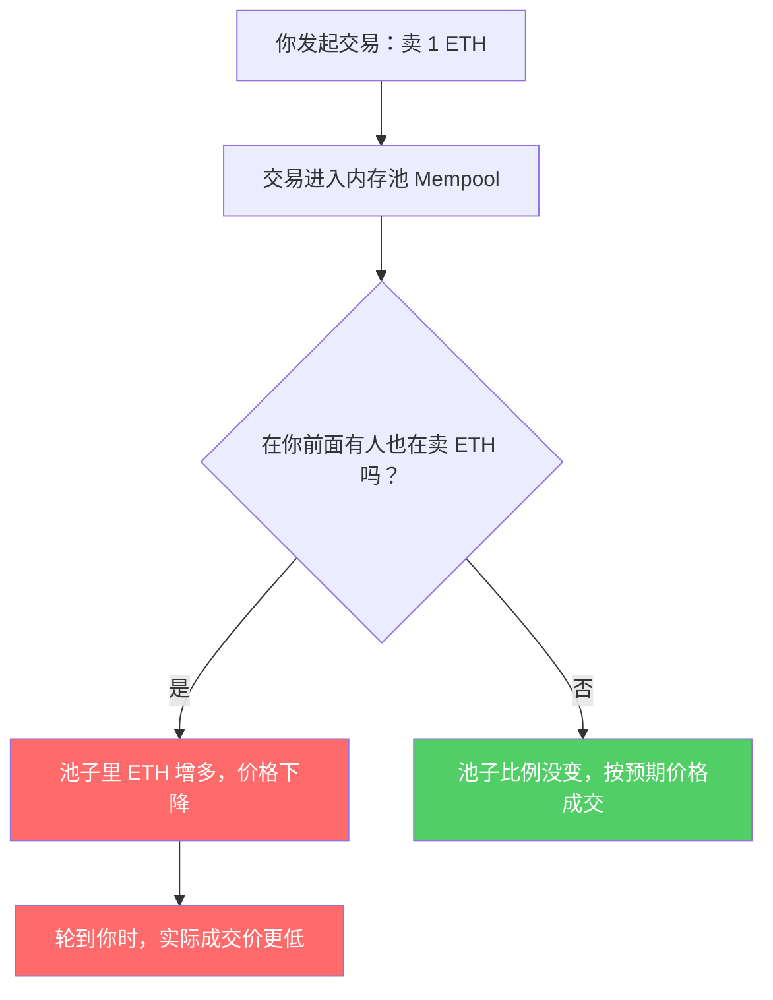
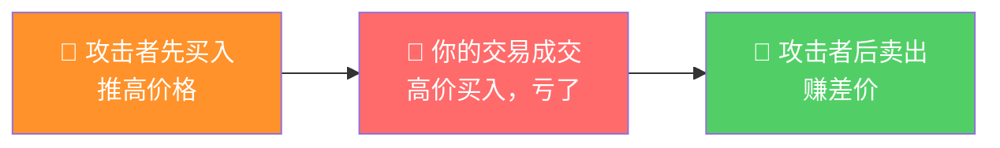
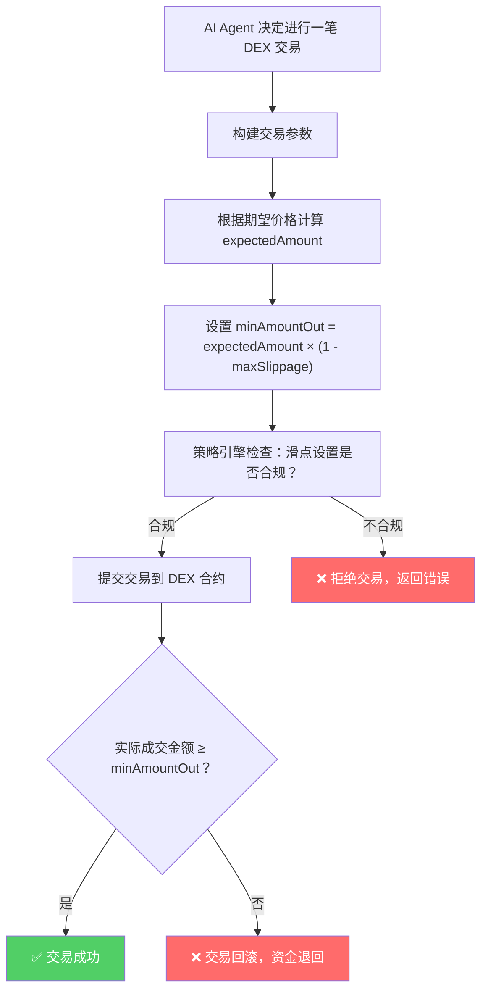

# DEX 交易滑点控制 — 知识文档

> 本文档为 AI Agent 钱包项目的知识库文档，专门讲解 DEX 交易中滑点的概念、原理和控制方法。
> 适用于对区块链和智能合约有基础了解，但对 DEX 和交易机制不熟悉的开发者。

---

## 📖 基础概念

### 1. 什么是 DEX？

**DEX（Decentralized Exchange，去中心化交易所）** 就像一个自动化的货币兑换机。最知名的就是 Uniswap。跟传统交易所（如 Binance、Coinbase）不同，DEX **没有中间人**，所有交易都通过智能合约自动完成。

**DEX vs CEX 对比：**

| 特性 | CEX（中心化交易所） | DEX（去中心化交易所） |
|------|-------------------|---------------------|
| 运营方 | 公司运营，有管理员 | 智能合约自动运行，无人管控 |
| 身份验证 | 需要 KYC | 无需注册，钱包连接即可 |
| 资金托管 | 交易所保管你的资金 | 你自己掌控资金（自托管） |
| 交易方式 | 订单簿（买卖双方挂单） | AMM（自动做市商） |
| 代表产品 | Binance、Coinbase、OKX | Uniswap、SushiSwap、Curve |

### 2. 什么是 AMM？

DEX 的核心机制叫 **AMM（Automated Market Maker，自动做市商）**。简单理解：

```
传统交易所：你要找一个愿意买你东西的人（订单簿模式）
DEX：永远有一个"自动售货机"跟你交易（AMM 模式）
```

这个"自动售货机"里有两个池子，比如 ETH 和 USDC：

```
┌─────────────────────────────┐
│   Uniswap ETH/USDC 池       │
│                             │
│   💰 100 ETH                │
│   💵 200,000 USDC           │
│                             │
│   价格 = 200,000 / 100      │
│        = 2,000 USDC/ETH     │
└─────────────────────────────┘
```

**恒定乘积公式（x * y = k）** 是 AMM 的核心数学模型：

```
池子里: ETH 数量 (x) × USDC 数量 (y) = 常数 (k)

100 ETH × 200,000 USDC = 20,000,000 (k 值)

当你卖 1 ETH 进池子:
- ETH 变成 101，USDC 变成约 198,019.8
- 新价格 = 198,019.8 / 101 ≈ 1,960.4 USDC/ETH
- 价格下降了！因为池子里 ETH 多了
```

### 3. 流动性池（Liquidity Pool）

流动性池就是 AMM 中存放两种代币的"池子"，由流动性提供者（LP）存入资金形成。

```
流动性深度 = 池子里资金量

深度大 → 大额交易对价格影响小 → 滑点小
深度小 → 大额交易对价格影响大 → 滑点大
```

---

## 📉 什么是滑点（Slippage）？

**滑点 = 你期望的价格 和 实际成交价格 之间的差距**

### 举例说明

```
1. 你查看 Uniswap：1 ETH = 2,000 USDC  ← 这是你看到的价格
2. 你点击"兑换"，把 1 ETH 换成 USDC
3. 实际成交：1 ETH = 1,980 USDC        ← 这是实际价格

滑点 = (2000 - 1980) / 2000 = 1%
```

**用更直观的比喻：**

想象你在超市看到苹果标价 5 元/斤，但结账时收银员说 4.95 元/斤。这 0.05 元的差距就是"滑点"。在 DEX 里，这种价格偏差可能更大，因为价格是实时由池子里的供需关系决定的。

---

## 🔍 为什么会有滑点？

### 原因一：池子流动性变化



**核心逻辑：** 你的交易改变了池子里的资产比例，比例变了，价格就变了。交易金额相对池子越大，价格变化越大，滑点越大。

### 原因二：前排交易（Front-running）/ 三明治攻击

这是最需要理解的滑点来源，也是 DeFi 中最常见的攻击方式。

**核心前提：** 内存池（Mempool）是公开的，你提交的交易在被打包上链之前，所有人都能看到。

#### 用具体数值走一遍完整流程

假设 Uniswap 上有个 ETH/USDC 池子：

```
池子资产：100 ETH + 200,000 USDC
当前价格：1 ETH = 2,000 USDC
```

**第 1 步：你发出大额交易**

你想用 10,000 USDC 买入 ETH，期望得到约 4.76 ETH。交易提交后进入内存池等待打包。

**第 2 步：攻击者看到了你的交易**

攻击者（一个监控内存池的机器人）发现你的大额买单，立刻用更高的 Gas 费抢在你前面提交一笔买入交易（Gas 费高 → 矿工优先打包）。

**第 3 步：攻击者的交易先成交**

```
成交前：100 ETH + 200,000 USDC  →  价格 2,000 USDC/ETH
攻击者买入后：约 97.56 ETH + 205,000 USDC  →  价格涨到约 2,102 USDC/ETH
攻击者拿到了约 2.44 ETH
```

**第 4 步：你的交易成交（价格已经变了！）**

```
你用 10,000 USDC 买入 ETH
由于价格已经被推高到 2,102，你只拿到约 4.52 ETH（而不是 4.76 ETH）

你的损失：4.76 - 4.52 = 0.24 ETH ≈ 480 USDC
```

**第 5 步：攻击者立刻卖出获利**

```
攻击者买入成本：5,000 USDC
攻击者卖出获得：约 5,120 USDC
净利润：120 USDC（几乎零风险，这就是你的损失！）
```

#### 为什么叫"三明治攻击"？

你的交易被攻击者的两笔交易"夹"在中间，像一个三明治 🥪：



#### 为什么攻击者能"抢在你前面"？

```
区块链交易的打包顺序 = 谁出的 Gas 费高，谁先打包

┌─────────────────────────────────────────┐
│  内存池（Mempool）                        │
│                                         │
│  你的交易：Gas 20 Gwei  ← 出价低，排队中  │
│  攻击者：  Gas 50 Gwei  ← 出价高，插队！  │
│                                         │
│  矿工/验证者：谁的 Gas 高就先打包谁的      │
└─────────────────────────────────────────┘
就像排队买东西，有人给保安塞了小费就插到你前面了。
```

#### 滑点保护怎么防住这个攻击？

如果设置了 1% 滑点容忍度：

```
你期望得到：4.76 ETH
滑点 1% 的底线：4.76 × 0.99 = 4.71 ETH

实际只拿到了 4.52 ETH < 4.71 ETH  →  交易自动回滚！
你的 10,000 USDC 退回，攻击者的计划落空了
```

**滑点保护的本质：设一个"最低可接受价格"，被插队导致价格偏差太大就不买了！**

---

## 🛡️ 滑点控制的原理

在 DEX 交易时，你需要设置一个 **滑点容忍度（Slippage Tolerance）**：

```
滑点容忍度 = 你愿意接受的最大价格偏差

比如设置 1%：
- 如果实际滑点 ≤ 1%：交易正常执行 ✅
- 如果实际滑点 > 1%：交易自动回滚（取消）❌
```

在 Uniswap 界面上就是这样的设置：

```
┌──────────────────────────────┐
│  ⚙️ 设置                      │
│                              │
│  滑点容忍度                   │
│  ○ 0.1%                      │
│  ○ 0.5%                      │
│  ● 1.0%  ← 你选了这个        │
│  ○ 3.0%                      │
│  ○ 自定义: ___%              │
└──────────────────────────────┘
```

### 技术实现：minAmountOut

在调用 DEX 合约的 swap 函数时，核心参数之一是 `amountOutMin`（最少获得的输出代币数量）：

```
amountOutMin = 期望输出数量 × (1 - 滑点容忍度)

举例：
- 你想把 1 ETH 换成 USDC
- 当前价格：1 ETH = 2,000 USDC
- 滑点容忍度：1%

amountOutMin = 2000 × (1 - 0.01) = 1980 USDC

含义：如果实际能换到 ≥ 1980 USDC，交易执行；否则回滚。
```

---

## 🤖 AI Agent 场景下的滑点保护

在 AI Agent 钱包中，滑点控制更加关键，因为：

```
人类用户：
- 看到价格不合适，可以手动取消
- 知道什么是"太大"的滑点
- 有直觉判断

AI Agent：
- 没有直觉判断，必须用代码设定边界
- 如果没设滑点保护，Agent 可能在极端情况下造成巨大损失
- 全自动执行，无人干预
```

### 在策略引擎中的实现思路

在 `PolicyEngine` 中增加滑点保护，核心逻辑是：

```solidity
// 在 PolicyConfig 中新增滑点参数
struct SlippageParams {
    bool enabled;              // 是否启用滑点保护
    uint256 maxSlippageBps;    // 最大滑点（基点，1% = 100 bps）
}

// 在 checkTransaction 中检查滑点
function checkSlippage(
    address _agent,
    uint256 _expectedAmount,    // 期望得到的数量
    uint256 _minAmountOut       // 实际最少得到的数量
) internal view returns (bool, string memory) {
    SlippageParams storage params = slippageParams[_agent];
    if (!params.enabled) return (true, "");

    // 计算实际滑点
    uint256 slippage = ((_expectedAmount - _minAmountOut) * 10000) / _expectedAmount;

    if (slippage > params.maxSlippageBps) {
        return (false, "PolicyEngine: slippage exceeds limit");
    }
    return (true, "");
}
```

### Agent 调用 DEX 时的完整流程



---

## ⚙️ 滑点容忍度怎么选？

| 设置值 | 适用场景 | 风险 |
|--------|----------|------|
| **0.1% - 0.5%** | 大流动性池（如 ETH/USDC 主网） | 交易可能因滑点超限而频繁失败 |
| **1%** | 一般 DeFi 操作的推荐值 | 适中 |
| **3% - 5%** | 小流动性池或波动大的代币 | 可能遭受较大损失 |
| **> 5%** | ❌ AI Agent 不建议使用 | 可能被三明治攻击 |

---

## 🥪 三明治攻击防御方法 — 深入篇

> 攻击原理和数值推演已在上文「原因二：前排交易」中详细说明，这里重点讲 **防御手段**。

### 防御方法对比

| 方法 | 原理 | 效果 | 适用场景 |
|------|------|------|----------|
| **设置滑点容忍度** | 超限自动回滚，攻击者白忙一场 | ✅ 基础防线 | 所有 DEX 交易必设 |
| **使用 Flashbots/私有内存池** | 交易不进入公开内存池，攻击者看不到 | ✅✅ 根治 | 大额交易、高价值操作 |
| **分批交易** | 将大额交易拆成多笔小额，减小对池子的冲击 | ✅ 降低滑点 | 流动性较浅的池子 |
| **选择流动性深的池子** | 大池子价格冲击小，攻击者利润空间也小 | ✅ 预防 | 优先选主流交易对 |

### Flashbots 是什么？

Flashbots 是一种让交易"暗箱操作"的方式：

```
普通交易流程：你的交易 → 公开内存池（所有人可见）→ 矿工打包
Flashbots 流程：你的交易 → 私有通道（只有矿工可见）→ 矿工打包

攻击者根本看不到你的交易，自然无法抢跑。
```

可以理解为：普通交易是"明信片"（谁都能看），Flashbots 是"密封信封"（只有收件人能看）。

---

## 🏊 LP 与流动性池深入

### LP 是什么？

**LP（Liquidity Provider，流动性提供者）** 就是往池子里"存钱"的人。

```
想象一个外币兑换店：
- 店里需要有人先放一些美元和人民币在柜台上，客户才能来兑换
- LP 就是"放钱在柜台上"的人
- 作为回报，每笔兑换的手续费会按比例分给 LP
```

**LP 的收益来源：**

```
每笔 DEX 交易都有手续费（如 Uniswap V2 收 0.3%）

手续费分配：0.3% 全部给 LP（按资金比例分配）

举例：
- 你在 ETH/USDC 池中存了总池子 10% 的资金
- 某天池子产生了 100 USDC 手续费
- 你分到 100 × 10% = 10 USDC
```

### 池子最初的 token 对怎么决定数量？

**第一个 LP 决定了初始价格。**

```
场景：你想创建一个全新的 TOKEN/ETH 池子

1. TOKEN 当前市场价格：1 TOKEN = 0.01 ETH
2. 你作为第一个 LP，决定存入：
   - 10,000 TOKEN
   - 100 ETH（= 10,000 × 0.01）
3. 初始价格 = 100 ETH / 10,000 TOKEN = 0.01 ETH/TOKEN ✅
4. 恒定乘积 k = 10,000 × 100 = 1,000,000

后续 LP 必须按当前池子比例存入：
- 如果现在池子是 9,000 TOKEN + 111.11 ETH
- 新 LP 必须按 9000:111.11 的比例存入
- 不能只存一种 token，必须两边都存
```

### LP 的风险：无常损失（Impermanent Loss）

```
无常损失 = LP 提供流动性后的资产价值 vs 简单持有（不存入池子）的资产价值

两者的差额就是"无常损失"

举例：
1. 你存入 1 ETH + 2,000 USDC（价格 1 ETH = 2,000 USDC）
2. ETH 价格涨到 3,000 USDC
3. 池子通过套利者交易，比例变为约 0.816 ETH + 2,449 USDC
4. 你的 LP 资产价值 = 0.816 × 3,000 + 2,449 = 4,897 USDC
5. 如果简单持有 = 1 × 3,000 + 2,000 = 5,000 USDC
6. 无常损失 = 5,000 - 4,897 = 103 USDC（约 2%）

关键结论：
- 价格变化越大，无常损失越大
- 价格翻倍 → 无常损失约 5.7%
- 价格翻3倍 → 无常损失约 20%
- 如果价格回到初始值，无常损失消失（所以叫"无常"）
- LP 需要靠手续费收入来弥补无常损失
```

### 池子的信任模型：谁来保证安全？

**核心事实：DeFi 没有传统意义上的"合规背书"方。** 信任来源是多层的：

```
传统金融：信任银行 → 银行受监管 → 监管机构背书
DeFi：    信任代码 → 代码公开透明 → 数学保证 + 审计 + 运行记录
```

| 信任层 | 说明 | 类比 |
|--------|------|------|
| **代码开源** | 所有 DEX 合约代码公开可审查 | 银行的账本对所有人公开 |
| **数学保证** | 恒定乘积公式保证价格计算不可被篡改 | 天平秤的物理原理不可被欺骗 |
| **智能合约审计** | 专业安全公司审计代码 | 银行接受外部审计 |
| **不可篡改** | 合约部署后逻辑无法修改 | 银行不能随意改规则 |
| **自托管** | 你的资金在你自己的钱包里，不是存在 DEX | 你的现金在你自己口袋里 |
| **TVL（总锁仓量）** | 池子里有多少钱，公开可查 | 银行的资本充足率 |
| **运行记录** | 合约运行时间越长、交易越多，越可信 | 银行的经营年限和口碑 |

**风险提示：**

```
⚠️ 以下情况仍可能导致资金损失：
1. 合约漏洞（代码 bug）→ 选择经过多次审计的老牌 DEX
2. 前排交易（MEV）→ 设置合理的滑点保护
3. 无常损失 → 了解风险，选择稳定币池或高手续费池
4. Rug Pull（项目方跑路）→ 只用知名协议，检查合约是否可暂停
```

---

## 📊 AMM 价格冲击与"后来者更亏"特性

### 为什么同方向交易中后来者永远更亏？

这是 AMM 机制的**固有属性**，不是 bug，也不是攻击。

```
池子状态：100 ETH + 200,000 USDC（k = 20,000,000）

用户 A 先买入 5,000 USDC 的 ETH：
  买入后：约 97.56 ETH + 205,000 USDC
  用户 A 得到：100 - 97.56 = 2.44 ETH
  实际价格：5,000 / 2.44 ≈ 2,049 USDC/ETH

用户 B 再买入 5,000 USDC 的 ETH：
  买入后：约 95.24 ETH + 210,000 USDC
  用户 B 得到：97.56 - 95.24 = 2.32 ETH
  实际价格：5,000 / 2.32 ≈ 2,155 USDC/ETH

同样的 5,000 USDC，用户 B 比 A 少拿了 0.12 ETH！
因为用户 A 的交易推高了价格，用户 B 买得更贵了
```

**数学本质：**

```
AMM 的价格曲线不是一条直线，而是一条双曲线

x × y = k
→ y = k / x

每次买入 x_token，x 减少，导致 y = k/x 增大
→ 价格随买入量递增（越买越贵）
→ 后来的买入者面对的是被推高后的价格
```

### 正常滑点 vs 三明治攻击：本质区别

| 维度 | 正常滑点 | 三明治攻击 |
|------|---------|-----------|
| **谁导致价格变化** | 市场自然交易顺序 | 攻击者故意插队 |
| **是否有人专门获利** | 没人 — 滑点损失分散在池子中 | 攻击者 — 精准赚取你的差价 |
| **你的损失去向** | 所有 LP 共享（你的损失 = LP 的额外收益） | 被攻击者拿走 |
| **能否防御** | 无法避免（AMM 机制决定） | 可通过滑点保护 / Flashbots 防御 |
| **发生频率** | 每笔交易都有 | 仅在有攻击者监控时 |
| **损失程度** | 通常较小（与交易量/池深成正比） | 可能很大（攻击者刻意制造最大滑点） |

**一句话总结：**

> 正常滑点是你"走路踩到水坑"（无法避免的路面状况），三明治攻击是有人"故意在你必经之路上泼水"（人为制造不利条件来获利）。

---

## 📌 总结

| 概念 | 一句话解释 |
|------|-----------|
| **DEX** | 去中心化交易所，用智能合约自动撮合交易 |
| **AMM** | 自动做市商，用资产池的供需关系定价 |
| **恒定乘积公式** | x × y = k，池子两边资产量的乘积不变 |
| **流动性池** | AMM 中存放两种代币的"池子"，由 LP 提供 |
| **LP** | 流动性提供者，往池子里存钱赚手续费的人 |
| **无常损失** | LP 因价格变化导致的资产价值损失（vs 简单持有） |
| **滑点** | 你看到的价格和实际成交价的差异 |
| **滑点容忍度** | 你愿意接受的最大偏差，超出就取消交易 |
| **minAmountOut** | 交易参数，指定最少获得的输出数量，用于滑点保护 |
| **策略引擎滑点保护** | 用代码强制限制 Agent 的滑点上限，防止极端损失 |
| **三明治攻击** | 攻击者前后夹击你的交易，利用滑点赚差价 |
| **Front-running** | 别人看到你的交易后抢先交易，改变价格 |
| **价格冲击** | 你的交易本身导致的价格变化，AMM 固有属性 |

---

## 🔗 相关资源

- [Uniswap V2 白皮书](https://uniswap.org/whitepaper.pdf) — AMM 恒定乘积模型
- [Uniswap V3 白皮书](https://uniswap.org/whitepaper-v3.pdf) — 集中流动性
- [EIP-4337 规范](https://eips.ethereum.org/EIPS/eip-4337) — 账户抽象标准
- 项目策略引擎合约：[contracts/PolicyEngine.sol](../contracts/PolicyEngine.sol)
- 项目策略引擎教程：[docs/03-policy-engine.md](../docs/03-policy-engine.md)
